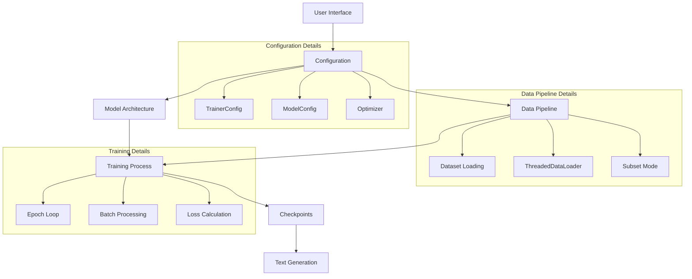

# LightLM System - Simple Workflow



## Key Commands

### 1. Start the system
```bash
python train.py
```

### 2. Optimize for fast training
```
Select option 2 (Manage dataset/configuration)
Select option 5 (Optimize for training time)
Enter 0.001 hours
```

### 3. Train the model
```
Select option 1 (Start training)
```

### 4. Generate text
```bash
python generate.py
Enter your prompt
```
