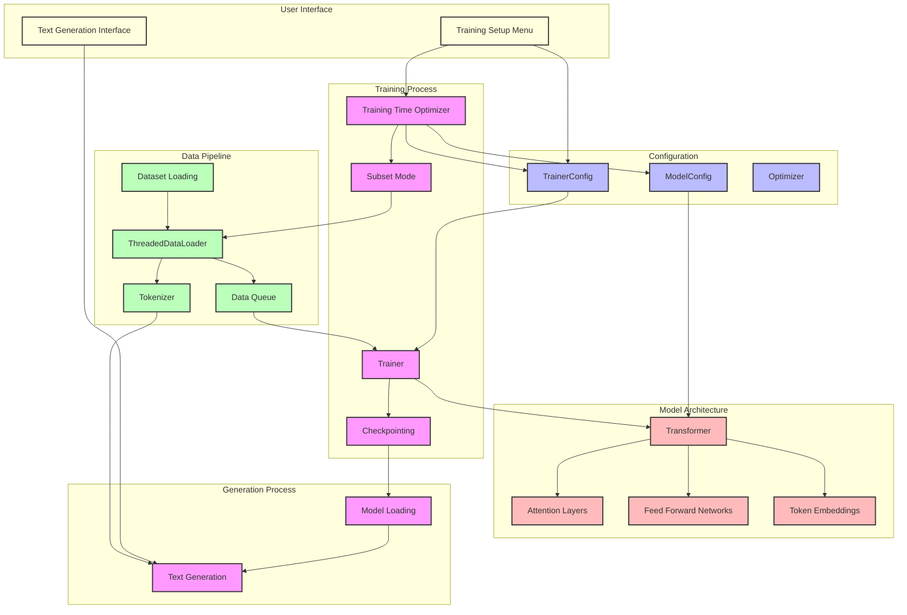

# LightLM System Workflow



## LightLM System Workflow Guide

This document explains the workflow of the LightLM system, including commands to run at each step and expected outputs.

### 1. System Setup

**Command:**
```bash
python -m venv venv
source venv/bin/activate  # On Windows: venv\Scripts\activate
pip install -r requirements.txt
```

**Expected Output:**
```
Successfully installed torch transformers datasets rich ...
```

### 2. Training Configuration

**Command:**
```bash
python train.py
```

**Expected Output:**
```
System Check:
✓ Python Version: Python 3.11 detected ✓
✓ GPU Status: GPU detected ✓
✓ Disk Space: Disk space: 22.0GB free ✓
✓ RAM: RAM: 15.8GB ✓
✓ Tokenizer loaded successfully

Training Setup
1. Start training
2. Manage dataset/configuration
3. Exit

Select option (1-3):
```

**Explanation:**
- The system performs hardware checks to ensure your system meets requirements
- Select option 2 to manage dataset and configuration

### 3. Dataset and Configuration Management

**Command:**
```
2  # Select option 2 from previous menu
```

**Expected Output:**
```
Dataset and Configuration Management
1. Change dataset
2. Load existing configuration
3. Create new configuration
4. Save current configuration
5. Optimize for training time
6. Continue with current settings
7. Exit
```

**Explanation:**
- Option 1: Change the dataset (default is wikitext)
- Option 5: Optimize configuration for specific training time

### 4. Training Time Optimization

**Command:**
```
5  # Select option 5 from previous menu
```

**Expected Output:**
```
Enter desired training time in hours (e.g., 24.0): 0.001

Starting Comprehensive Configuration Optimization
Target training time: 0.001000 hours

Hardware Capabilities:
→ Maximum batch size: 12
→ Available GPU memory: 8.0GB
→ Flash Attention support: False
→ GPU Compute Capability: 6.1

Optimizing for ultra-fast testing mode (sub-second)

Speed Optimizations:
→ Dataset: Using minimal subset (20 samples)
→ Device transfers: Minimized for speed
→ Memory tracking: Disabled for faster execution
→ Minimized model architecture:
  • Layers: 1
  • Dimensions: 64
  • Heads: 4

Apply these optimizations? (y/n):
```

**Explanation:**
- Enter a small value (e.g., 0.001) for ultra-fast testing
- The system will optimize model size, batch size, and dataset size
- Type 'y' to apply these optimizations

### 5. Save Configuration

**Command:**
```
4  # Select option 4 to save configuration
```

**Expected Output:**
```
✓ Configuration saved successfully
```

**Explanation:**
- This saves your configuration to last_config.json for future use

### 6. Start Training

**Command:**
```
6  # Select option 6 to continue with current settings
1  # Select option 1 to start training
```

**Expected Output:**
```
✓ Model initialized successfully
Using subset of 20 samples
Using subset mode: 20 samples out of 36718
Subset mode active: Using only 20 samples with 5 steps per epoch
✓ Data loader initialized with 5 steps per epoch

Initializing Trainer:
→ Device: cuda
→ Model type: Transformer
→ Tokenizer: GPT2TokenizerFast
✓ Model moved to cuda
✓ Optimizer initialized with lr=0.0005

Starting training:
→ Total steps: 5
→ Steps per epoch: 5

Epoch 1/1
Step 1/5 | Loss: 10.5605 | Tokens/sec: 89.24 | Memory: 89MB used
Step 2/5 | Loss: 5.1702 | Tokens/sec: 123.77 | Memory: 89MB used
Step 3/5 | Loss: 5.1276 | Tokens/sec: 124.10 | Memory: 89MB used
Step 4/5 | Loss: 5.0330 | Tokens/sec: 125.39 | Memory: 89MB used
Step 5/5 | Loss: 5.0330 | Tokens/sec: 125.39 | Memory: 89MB used

Saving checkpoint to ./model_testing\epoch_1
✓ Checkpoint saved successfully

Training completed successfully! Used 20 samples
```

**Explanation:**
- The system initializes the model with the optimized configuration
- It loads only 20 samples for ultra-fast training
- Training completes in seconds with 5 steps
- Model checkpoint is saved to model_testing/epoch_1/model.pt

### 7. Text Generation

**Command:**
```bash
python generate.py
```

**Expected Output:**
```
Text Generation Interface
Found model in model_testing\epoch_1

Loading model from: model_testing\epoch_1\model.pt
Model size: 12.24 MB

Loading model...
✓ Model loaded successfully from model_testing\epoch_1\model.pt

Model Configuration:
→ Vocab Size: 49152
→ Context Length: 64
→ Model Dimensions: 64
→ Number of Layers: 1

Enter your prompt (or 'quit' to exit):
```

**Explanation:**
- The system finds and loads the trained model
- Enter a prompt to generate text (e.g., "What is the meaning of life?")
- The generated text will be random since the model was only trained on 20 samples

### 8. Text Generation Example

**Command:**
```
What is the meaning of life?
```

**Expected Output:**
```
Generating...

Generated text:
What is the meaning of life? emancipation spawnedogel markers urging Antibspers dyesFold planners Methods wedham hundreds securitiesFourthtow propelled twenty Confederate Adolescentsidentiquedanchor ballistic chowedENCE skepticismriminals€™imates Chile calendar Academia...
```

**Explanation:**
- The output is random because the model was only trained on 20 samples
- For better results, train with more data and for longer time

### 9. Training with More Data

To train a more capable model:

**Command:**
```
python train.py
2  # Manage dataset/configuration
5  # Optimize for training time
```

**Input:**
```
Enter desired training time in hours (e.g., 24.0): 0.1
```

**Expected Output:**
```
Starting Comprehensive Configuration Optimization
Target training time: 0.100000 hours

Speed Optimizations:
→ Dataset: Using larger subset (1000 samples)
→ Model architecture:
  • Layers: 4
  • Dimensions: 256
  • Heads: 8
```

**Explanation:**
- Using a longer training time (0.1 hours) will result in:
  - Larger dataset subset
  - Larger model architecture
  - Better quality generated text

### 10. Advanced Configuration

For advanced users who want to manually configure the model:

**Command:**
```
python train.py
2  # Manage dataset/configuration
3  # Create new configuration
```

**Expected Output:**
```
Model Configuration:
1. Number of layers: 12
2. Model dimensions: 768
3. Number of attention heads: 12
4. Context length: 1024
5. Use Flash Attention: False
6. Use Mixture of Experts: False
7. Save and continue
```

**Explanation:**
- This allows manual configuration of all model parameters
- Larger values result in a more capable but slower-to-train model

### Troubleshooting

If you encounter errors:

1. **Out of memory errors**: Reduce model size or batch size
2. **Model not found**: Check that the checkpoint path exists
3. **Slow training**: Enable Flash Attention if supported by your GPU
4. **Poor generation quality**: Train with more data and for longer time
