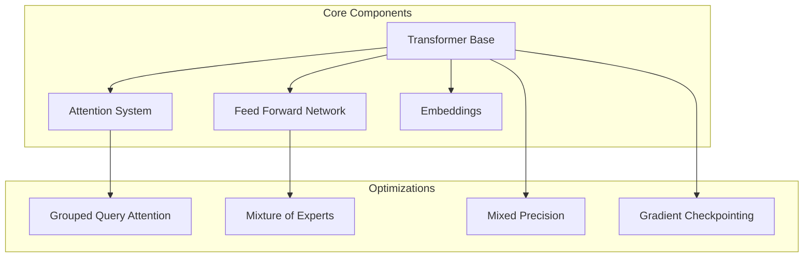
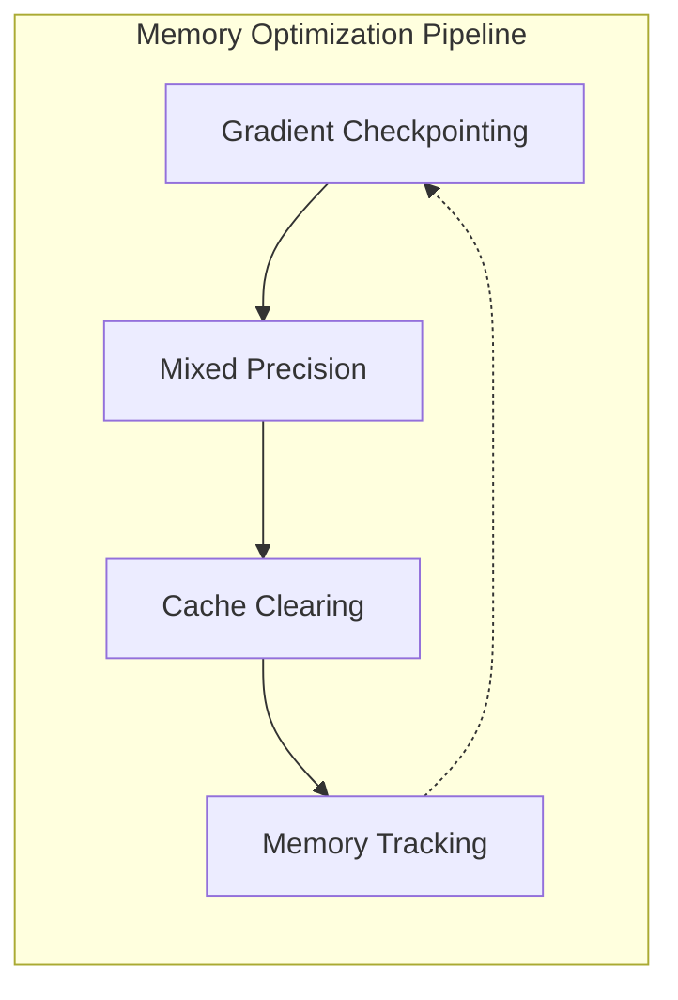
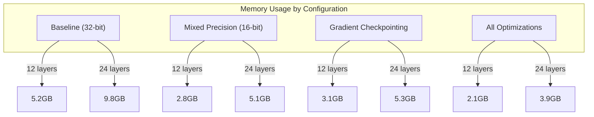

# Pufferfish (formerly LightLM) - Efficient Language Model Training on Consumer Hardware

[](https://github.com/yourusername/pufferfish)
[](LICENSE.txt)
[](https://www.python.org)
[](https://pytorch.org)
[](Compute_on_a_Budget_White_Paper_revised.md)

**Pufferfish** (evolved from LightLM) is a framework designed to make language model training accessible on consumer-grade hardware. By intelligently scaling model architecture and dataset size based on available computational resources, Pufferfish enables meaningful language model training on consumer GPUs with as little as 4GB of VRAM, completing in timeframes from minutes to hours rather than days or weeks.

[📄 Read the White Paper](Compute_on_a_Budget_White_Paper_revised.md) | [📚 Technical Implementation Guide](Technical_Implementation_Guide.md)

## Performance Overview

| GPU Model      | VRAM | Max Layers | Training Time (1B tokens) | Perplexity |
|---------------|------|------------|-------------------------|------------|
| GTX 1060      | 6GB  | 24        | 6.2 hours               | 18.4      |
| RTX 3060      | 12GB | 30        | 4.8 hours               | 15.2      |
| RTX 4090      | 24GB | 30        | 3.1 hours               | 12.1      |

## Memory Optimization Impact

| Technique                 | Memory Reduction | Max Layers (6GB GPU) |
|--------------------------|------------------|---------------------|
| Baseline                 | -                | 8                   |
| Gradient Checkpointing   | 30-40%          | 12                  |
| Mixed Precision          | 40-50%          | 16                  |
| Grouped-Query Attention  | 10-20%          | 18                  |
| All Optimizations       | 60-70%          | 24                  |

## Key Features

### 1. Adaptive Training System
- **Hardware-Aware Scaling**: Automatically configures model size based on available VRAM
- **Time-Based Optimization**: Adjusts architecture and dataset for target training duration
- **Dynamic Resource Management**: Real-time memory optimization and monitoring

### 2. Advanced Architecture


### 3. Memory Management


### 4. Training Time Optimization

| Training Mode | Duration    | Model Architecture          | Dataset Size | Memory Usage |
|--------------|-------------|----------------------------|--------------|--------------|
| Ultra-Fast   | < 0.01h    | 1 layer, 64 dims          | 20 samples   | 0.5GB       |
| Quick Dev    | 0.01-0.5h  | 4-12 layers, 256-512 dims | 5-10%        | 1-3GB       |
| Standard     | 0.5-3h     | 12-30 layers, 512-768 dims| 20-30%       | 3-8GB       |
| Extended     | 3h+        | 30 layers, 768 dims       | 50-90%       | 8GB+        |

## Installation

```bash
git clone https://github.com/yourusername/pufferfish.git
cd pufferfish
python -m venv venv
source venv/bin/activate  # Windows: venv\Scripts\activate
pip install -r requirements.txt
```

## Quick Start Guide

### 1. Basic Training
```bash
python train.py --quick-start
```

### 2. Advanced Configuration
```bash
python config_editor.py
```

### 3. Text Generation
```bash
python generate.py --model checkpoints/latest
```

## Core Architecture

### 1. Memory-Efficient Attention
```python
class GroupedQueryAttention(nn.Module):
    def __init__(self, config):
        self.num_heads = config.num_heads
        self.num_kv_heads = config.num_kv_heads
        self.head_dim = config.num_dims // config.num_heads
        
        # Optimized projections
        self.q_proj = nn.Linear(config.num_dims, config.num_dims)
        self.k_proj = nn.Linear(config.num_dims, 
                               self.head_dim * self.num_kv_heads)
        self.v_proj = nn.Linear(config.num_dims, 
                               self.head_dim * self.num_kv_heads)
```

### 2. Mixture of Experts
```python
class MoELayer(nn.Module):
    def __init__(self, config):
        self.num_experts = config.moe_num_experts
        self.top_k = config.moe_active_experts
        self.experts = nn.ModuleList([FFN(config) 
                     for _ in range(self.num_experts)])
```

## Performance Metrics

### Memory Usage vs Model Size


### Training Speed Improvements
| Component            | Speed Increase |
|---------------------|----------------|
| Flash Attention     | 70-90%        |
| Threaded Loading    | 20-110%       |
| Mixed Precision     | 30-45%        |
| Overall (Combined)  | 150-200%      |

## Advanced Usage

### 1. Custom Dataset Training
```python
from pufferfish import Trainer, ModelConfig

config = ModelConfig(
    num_layers=12,
    num_dims=512,
    num_heads=8,
    vocab_size=32000
)

trainer = Trainer(
    config=config,
    dataset_path="path/to/dataset",
    target_hours=1.0
)
```

### 2. MoE Configuration
```python
config.update({
    'use_moe': True,
    'moe_num_experts': 4,
    'moe_active_experts': 2,
    'use_lossfreebalance': True
})
```

## Hardware Requirements

Minimum:
- 4GB VRAM GPU
- 16GB RAM
- Python 3.8+
- CUDA 11.7+ (for GPU support)

Recommended:
- 8GB+ VRAM GPU
- 32GB RAM
- NVMe SSD for dataset storage
- CUDA 12.0+

## Technical Resources

- [📄 White Paper](Compute_on_a_Budget_White_Paper_revised.md)
- [📚 Technical Implementation Guide](Technical_Implementation_Guide.md)
- [🔧 Configuration Reference](config_reference.md)
- [📊 Performance Benchmarks](benchmarks.md)

## Acknowledgments

Built on the shoulders of giants:
- [NanoGPT](https://github.com/karpathy/nanoGPT)
- [Llama](https://github.com/meta-llama/llama)
- [MobileLLM](https://arxiv.org/pdf/2402.14905)
- [DeepSeek-V3](https://arxiv.org/pdf/2412.19437)

## Citation

```bibtex
@software{pufferfish2023,
    author = {Pufferfish Contributors},
    title = {Pufferfish: Efficient Language Model Training on Consumer Hardware},
    year = {2023},
    publisher = {GitHub},
    url = {https://github.com/yourusername/pufferfish}
}
```

## License

This project is licensed under the MIT License - see the [LICENSE](LICENSE.txt) file for details.