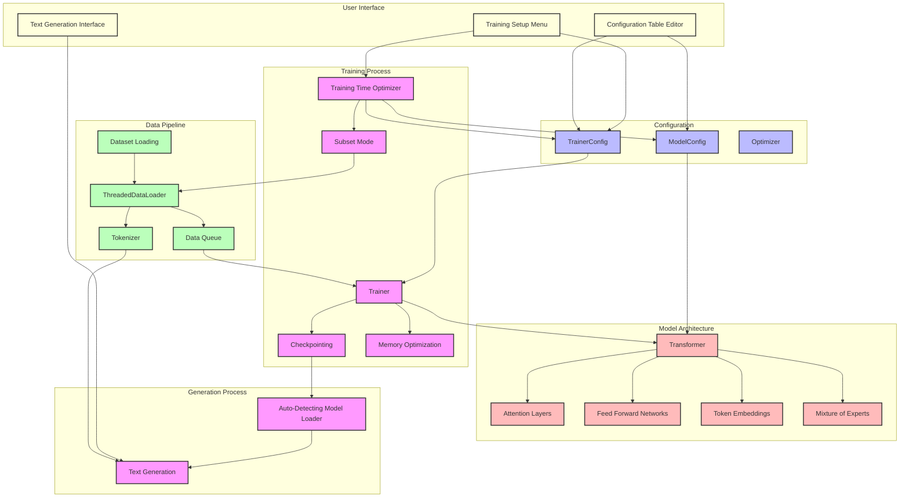
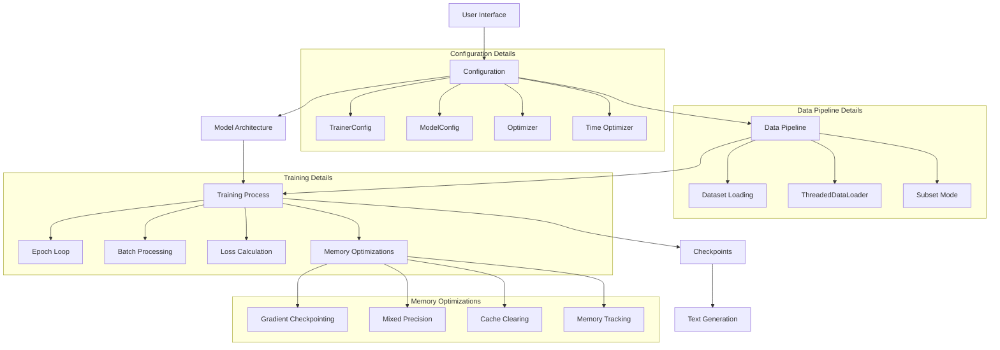

# Pufferfish (formerly LightLM) - Efficient Language Model Training on Consumer Hardware
[white paper](Compute_on_a_Budget_White_Paper_revised.md)


**Pufferfish** (evolved from LightLM) is a lightweight language model framework designed for training and fine-tuning transformer models on consumer-grade hardware. It focuses on efficiency, adaptability, and ease of use, making language model experimentation accessible to researchers and developers with limited computational resources.

## Project Evolution

Pufferfish began as LightLM, a basic implementation focused on lightweight language model training. The project has since evolved significantly, adding numerous features to enhance efficiency, usability, and performance while maintaining the core goal of making LLM training accessible on consumer hardware.

## Key Features

- **Adaptive Model Sizing**: Automatically scales model architecture based on available hardware and target training time
- **Time-Optimized Training**: Set your desired training time, and Pufferfish configures the optimal dataset size and model architecture
- **Resource-Efficient**: Designed to work on consumer GPUs with as little as 4GB VRAM
- **Rich Configuration Interface**: Interactive table-based editor for viewing and modifying all model and training parameters
- **Modern Architecture**: Implements state-of-the-art transformer techniques including:
  - Grouped Query Attention
  - SwiGLU Activation
  - Rotary Position Embeddings (RoPE)
  - RMSNorm
  - Optional Mixture of Experts (MoE)
  - Loss-free Load Balancing
- **Automatic Checkpoint Adaptation**: Generate script automatically detects model architecture from saved weights

## System Architecture



## Simplified Workflow



## Quick Start

### Installation

```bash
git clone https://github.com/yourusername/pufferfish.git
cd pufferfish
python -m venv venv
source venv/bin/activate  # On Windows: venv\Scripts\activate
pip install -r requirements.txt
```

### Training

```bash
python train.py
```

Follow the interactive menu to configure and start training:

1. Select "Manage dataset/configuration"
2. Choose "Optimize for training time"
3. Enter your desired training duration (e.g., 0.1 for quick testing, 5.0 for more thorough training)
4. Apply the optimizations
5. Save the configuration
6. Start training

### Text Generation

```bash
python generate.py
```

Enter your prompt and see the model's output. The generate script will automatically detect the model architecture from the saved weights.

## Training Time Optimization

Pufferfish's unique feature is its ability to optimize the training process based on your desired training time:

| Training Time | Model Size | Dataset Size | Use Case |
|---------------|------------|--------------|----------|
| < 0.01 hours  | Tiny (1 layer, 64 dims) | 20 samples | Ultra-fast testing |
| 0.01-0.1 hours | Small (4 layers, 256 dims) | 5% of dataset | Quick iteration |
| 0.1-0.5 hours | Medium (12 layers, 512 dims) | 10% of dataset | Development |
| 0.5-1 hours   | Standard (20 layers, 768 dims) | 20% of dataset | Serious training |
| 1-3 hours     | Standard (30 layers, 768 dims) | 30% of dataset | Extended training |
| 3-6 hours     | Full (30 layers, 768 dims) | 50% of dataset | Production quality |
| 6-12 hours    | Full (30 layers, 768 dims) | 70% of dataset | High quality |
| 12+ hours     | Full (30 layers, 768 dims) | 90% of dataset | Maximum quality |

## Configuration Table Editor

Pufferfish includes a comprehensive configuration table editor that provides a rich interface for viewing and modifying all settings:

```
╭────────────────────────────────────────────────────────────────────────────────────────────────────────────────────────────────────────────────────────────╮
│ Configuration Editor                                                                                                                                       │
╰────────────────────────────────────────────────── Use arrow keys to navigate, Enter to edit, ESC to exit ──────────────────────────────────────────────────╯
                                                                     Model Configuration                                                                      
╭─────────────────────────────────────────────┬──────────────────────┬───────────────────────────────────────────────────────────────────────────────────────╮
│ Parameter                                   │ Value                │ Description                                                                           │
├─────────────────────────────────────────────┼──────────────────────┼───────────────────────────────────────────────────────────────────────────────────────┤
│ vocab_size                                  │ 49152                │ Vocabulary size for tokenizer                                                         │
│ num_dims                                    │ 768                  │ Model dimension size (d_model)                                                        │
│ num_heads                                   │ 16                   │ Number of attention heads                                                             │
│ num_kv_heads                                │ 4                    │ Number of key/value heads                                                             │
│ num_layers                                  │ 30                   │ Number of transformer layers                                                          │
│ ffn_hidden_dims                             │ 1024                 │ Hidden dimension for FFN                                                              │
│ context_len                                 │ 2048                 │ Maximum context length                                                                │
│ use_cache                                   │ False                │ Enable KV-caching                                                                     │
│ use_flash                                   │ False                │ Use Flash Attention                                                                   │
│ use_moe                                     │ False                │ Enable mixture-of-experts                                                             │
```

## Efficiency Innovations

Pufferfish implements several key efficiency innovations:

1. **Adaptive Dataset Subsetting**: Automatically scales dataset size based on target training time
2. **Dynamic Model Sizing**: Adjusts model architecture based on available hardware and training time
3. **Memory Optimization Suite**:
   - Gradient checkpointing for reduced memory usage
   - Mixed precision training (float16/bfloat16)
   - Automatic cache clearing
   - Memory usage tracking and visualization
4. **Threaded Data Loading**: Background data preparation to minimize training bottlenecks
5. **Automatic Checkpoint Adaptation**: Generate script detects model architecture from saved weights
6. **Hardware-Aware Configuration**: Optimizes settings based on detected GPU capabilities

## Model Configuration

Pufferfish supports a wide range of configuration options:

- **Model Architecture**:
  - `num_layers`: Number of transformer layers (1-30)
  - `num_dims`: Model dimension size (64-768)
  - `num_heads`: Number of attention heads (4-16)
  - `num_kv_heads`: Number of key/value heads (1-16)
  - `ffn_hidden_dims`: Hidden dimension for feed-forward networks
  - `context_len`: Maximum context length for training and inference
  - `use_moe`: Enable Mixture of Experts for more efficient parameter usage

- **Training Parameters**:
  - `batch_size`: Batch size for training
  - `accumulation_steps`: Gradient accumulation steps
  - `learning_rate`: Learning rate
  - `weight_decay`: Weight decay for regularization
  - `warmup_ratio`: Ratio of warmup steps
  - `use_lora`: Enable LoRA fine-tuning
  - `gradient_checkpointing`: Enable gradient checkpointing for memory efficiency
  - `enable_memory_tracking`: Monitor memory usage during training
  - `empty_cache_freq`: Frequency of cache clearing operations

## Performance

The base Pufferfish model was trained on the [Cosmopedia v2](https://huggingface.co/datasets/HuggingFaceTB/cosmopedia) dataset (~28 billion tokens).

```
ARC-C Accuracy: 27.2% 
WinoGrande Accuracy: 52.8%
```

Example output when prompted with: "Hello, I am a language model,":

```
Hello, I am a language model, and I can help you learn more about the language you are interested in. Let's start with the basics.

Hello, I am a language model, and I can help you learn some new words and phrases. Maybe you could try saying "hello" in English first, then move on to Spanish,
```

## Pre-trained Models

You can download pre-trained weights [here](https://huggingface.co/Virg1n/LightLM).

## Advanced Usage

### Custom Dataset

To use your own dataset:

1. Format your data as a text file with one document per line
2. Select "Change dataset" in the configuration menu
3. Enter the path to your dataset file

### Mixture of Experts Configuration

Pufferfish supports Mixture of Experts (MoE) for more efficient parameter usage:

1. Enable MoE in the configuration editor
2. Configure the number of experts (typically 4-8)
3. Set the number of active experts per token (typically 1-2)
4. Optionally enable loss-free balancing for improved expert utilization

## Acknowledgments

This project was made possible with the inspiration and knowledge provided by the following sources:

- **[NanoGPT by Andrej Karpathy](https://github.com/karpathy/nanoGPT)**  
- **[MobileLLM](https://arxiv.org/pdf/2402.14905)**
- **[DeepSeek-V3 Technical Report](https://arxiv.org/pdf/2412.19437)**  
- **[Llama](https://github.com/meta-llama/llama)**  
- **[Cosmopedia Dataset](https://huggingface.co/datasets/HuggingFaceTB/cosmopedia)**  
- **[fineweb-edu Dataset](https://huggingface.co/datasets/HuggingFaceFW/fineweb-edu)**  

## Citation

If you use Pufferfish in your research, please cite:

```bibtex
@software{pufferfish2023,
  author = {Pufferfish Contributors},
  title = {Pufferfish: Efficient Language Model Training on Consumer Hardware},
  year = {2023},
  url = {https://github.com/yourusername/pufferfish}
}
```

## License

This project is licensed under the MIT License - see the LICENSE file for details.
