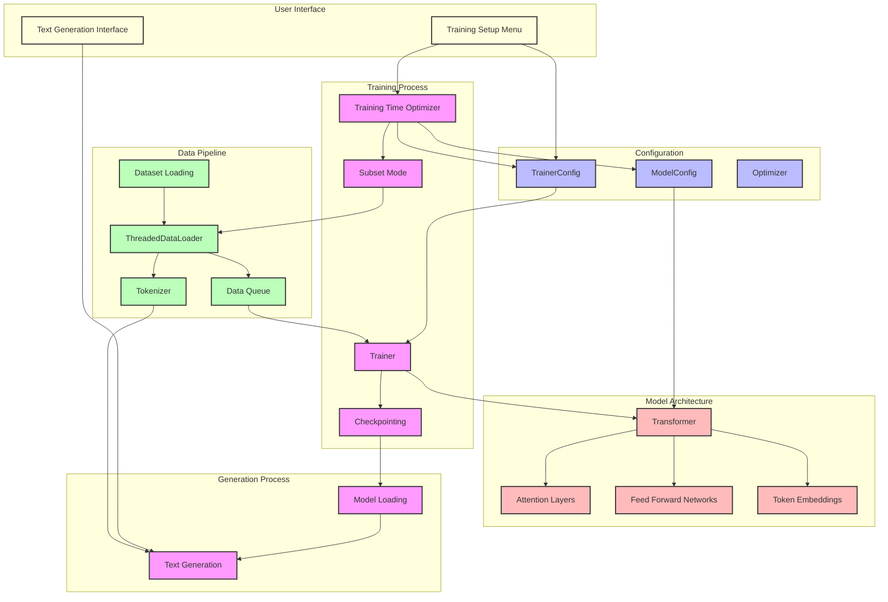
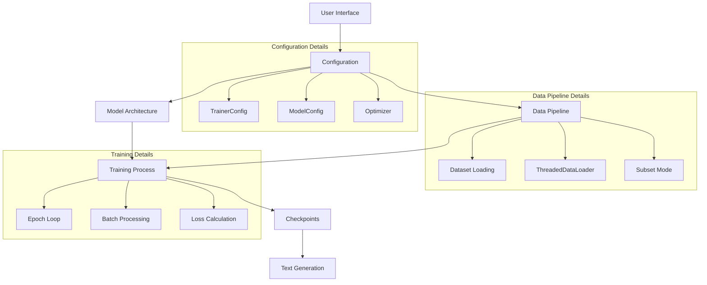

# LightLM - Efficient Language Model Training on Consumer Hardware


**LightLM** is a lightweight language model framework designed for training and fine-tuning transformer models on consumer-grade hardware. It focuses on efficiency, adaptability, and ease of use, making language model experimentation accessible to researchers and developers with limited computational resources.

## Key Features

- **Adaptive Model Sizing**: Automatically scales model architecture based on available hardware and target training time
- **Time-Optimized Training**: Set your desired training time, and LightLM configures the optimal dataset size and model architecture
- **Resource-Efficient**: Designed to work on consumer GPUs with as little as 4GB VRAM
- **Modern Architecture**: Implements state-of-the-art transformer techniques including:
  - Grouped Query Attention
  - SwiGLU Activation
  - Rotary Position Embeddings (RoPE)
  - RMSNorm
  - Optional Mixture of Experts (MoE)
  - Loss-free Load Balancing
- **Interactive Configuration**: User-friendly interface for model configuration and training management

## System Architecture



## Simplified Workflow



## Quick Start

### Installation

```bash
git clone https://github.com/yourusername/LightLM.git
cd LightLM
python -m venv venv
source venv/bin/activate  # On Windows: venv\Scripts\activate
pip install -r requirements.txt
```

### Training

```bash
python train.py
```

Follow the interactive menu to configure and start training:

1. Select "Manage dataset/configuration"
2. Choose "Optimize for training time"
3. Enter your desired training duration (e.g., 0.1 for quick testing, 5.0 for more thorough training)
4. Apply the optimizations
5. Save the configuration
6. Start training

### Text Generation

```bash
python generate.py
```

Enter your prompt and see the model's output.

## Training Time Optimization

LightLM's unique feature is its ability to optimize the training process based on your desired training time:

| Training Time | Model Size | Dataset Size | Use Case |
|---------------|------------|--------------|----------|
| < 0.01 hours  | Tiny (1 layer, 64 dims) | 20 samples | Ultra-fast testing |
| 0.1 hours     | Small (4 layers, 256 dims) | 5% of dataset | Quick iteration |
| 0.5 hours     | Medium (12 layers, 512 dims) | 10% of dataset | Development |
| 1-3 hours     | Standard (30 layers, 768 dims) | 20-30% of dataset | Serious training |
| 6+ hours      | Full (30 layers, 768 dims) | 50-90% of dataset | Production quality |

## Model Configuration

LightLM supports a wide range of configuration options:

- **Model Architecture**:
  - `num_layers`: Number of transformer layers (1-30)
  - `num_dims`: Model dimension size (64-768)
  - `num_heads`: Number of attention heads (4-16)
  - `num_kv_heads`: Number of key/value heads (1-16)
  - `ffn_hidden_dims`: Hidden dimension for feed-forward networks

- **Training Parameters**:
  - `batch_size`: Batch size for training
  - `learning_rate`: Learning rate
  - `weight_decay`: Weight decay for regularization
  - `warmup_ratio`: Ratio of warmup steps
  - `use_lora`: Enable LoRA fine-tuning
  - `gradient_checkpointing`: Enable gradient checkpointing for memory efficiency

## Performance

The base LightLM model was trained on the [Cosmopedia v2](https://huggingface.co/datasets/HuggingFaceTB/cosmopedia) dataset (~28 billion tokens).

```
ARC-C Accuracy: 27.2% 
WinoGrande Accuracy: 52.8%
```

Example output when prompted with: "Hello, I am a language model,":

```
Hello, I am a language model, and I can help you learn more about the language you are interested in. Let's start with the basics.

Hello, I am a language model, and I can help you learn some new words and phrases. Maybe you could try saying "hello" in English first, then move on to Spanish,
```

## Pre-trained Models

You can download pre-trained weights [here](https://huggingface.co/Virg1n/LightLM).

## Advanced Usage

### Custom Dataset

To use your own dataset:

1. Format your data as a text file with one document per line
2. Select "Change dataset" in the configuration menu
3. Enter the path to your dataset file

### Configuration Editor

LightLM includes a comprehensive configuration editor that allows you to view and modify all settings:

1. Select "Edit configuration table" in the configuration menu
2. Browse through model and training parameters
3. Edit any parameter to customize your training

## Acknowledgments

This project was made possible with the inspiration and knowledge provided by the following sources:

- **[NanoGPT by Andrej Karpathy](https://github.com/karpathy/nanoGPT)**  
- **[MobileLLM](https://arxiv.org/pdf/2402.14905)**
- **[DeepSeek-V3 Technical Report](https://arxiv.org/pdf/2412.19437)**  
- **[Llama](https://github.com/meta-llama/llama)**  
- **[Cosmopedia Dataset](https://huggingface.co/datasets/HuggingFaceTB/cosmopedia)**  
- **[fineweb-edu Dataset](https://huggingface.co/datasets/HuggingFaceFW/fineweb-edu)**  

## Citation

If you use LightLM in your research, please cite:

```bibtex
@software{lightlm2023,
  author = {LightLM Contributors},
  title = {LightLM: Efficient Language Model Training on Consumer Hardware},
  year = {2023},
  url = {https://github.com/yourusername/LightLM}
}
```

## License

This project is licensed under the MIT License - see the LICENSE file for details.
