# Detailed Training Flow in train.py

This document contains a detailed Mermaid diagram showing the complete flow of the training process in `train.py`, including how Unsloth could be integrated with the standard training flow.

## Complete Training Flow Diagram

```mermaid
flowchart TD
    %% Main Program Flow
    Start([Start train.py]) --> InitEnv[Initialize Environment]
    InitEnv --> LoadTokenizer[Load Tokenizer]
    LoadTokenizer --> MainMenu[Display Training Menu]
    
    %% Main Menu Options
    MainMenu --> |Option 1| StandardTraining[Standard Training]
    MainMenu --> |Option 2| UnslothTraining[Unsloth Training]
    MainMenu --> |Option 3| ManageConfig[Manage Dataset/Config]
    MainMenu --> |Option 4| Exit([Exit])
    
    %% Standard Training Flow
    StandardTraining --> LoadDataset1[Load Dataset]
    LoadDataset1 --> AdaptDataset1[Adapt Dataset Format]
    AdaptDataset1 --> InitModel[Initialize Model]
    InitModel --> ApplySubset[Apply Dataset Subsetting]
    ApplySubset --> InitDataLoader[Initialize ThreadedDataLoader]
    InitDataLoader --> InitTrainer[Initialize Trainer]
    InitTrainer --> StartTraining[Start Training Process]
    
    %% Training Process Details
    StartTraining --> TrainingLoop[Training Loop]
    
    %% Training Loop Subgraph
    subgraph TrainingLoop[Training Loop]
        direction TB
        LoopStart([Start Loop]) --> EpochLoop[For each epoch]
        EpochLoop --> BatchLoop[For each batch]
        
        BatchLoop --> LoadBatch[Load Batch from Queue]
        LoadBatch --> CheckMemory{Check Memory}
        
        CheckMemory -->|Low Memory| CPUProcessing[Process on CPU]
        CheckMemory -->|Sufficient Memory| GPUProcessing[Process on GPU]
        
        CPUProcessing --> AccumulateGradients1[Accumulate Gradients]
        GPUProcessing --> AccumulateGradients2[Accumulate Gradients]
        
        AccumulateGradients1 --> UpdateStep1{Update Step?}
        AccumulateGradients2 --> UpdateStep2{Update Step?}
        
        UpdateStep1 -->|Yes| OptimizerStep1[Optimizer Step]
        UpdateStep1 -->|No| NextBatch1[Next Batch]
        
        UpdateStep2 -->|Yes| OptimizerStep2[Optimizer Step]
        UpdateStep2 -->|No| NextBatch2[Next Batch]
        
        OptimizerStep1 --> LogMetrics1[Log Metrics]
        OptimizerStep2 --> LogMetrics2[Log Metrics]
        
        LogMetrics1 --> CheckpointCheck1{Checkpoint?}
        LogMetrics2 --> CheckpointCheck2{Checkpoint?}
        
        CheckpointCheck1 -->|Yes| SaveCheckpoint1[Save Checkpoint]
        CheckpointCheck1 -->|No| NextBatch1
        
        CheckpointCheck2 -->|Yes| SaveCheckpoint2[Save Checkpoint]
        CheckpointCheck2 -->|No| NextBatch2
        
        SaveCheckpoint1 --> NextBatch1
        SaveCheckpoint2 --> NextBatch2
        
        NextBatch1 --> BatchLoop
        NextBatch2 --> BatchLoop
        
        BatchLoop --> |End of Epoch| EpochCheckpoint[Save Epoch Checkpoint]
        EpochCheckpoint --> EpochLoop
        
        EpochLoop --> |End of Training| LoopEnd([End Loop])
    end
    
    TrainingLoop --> SaveFinalModel[Save Final Model]
    SaveFinalModel --> ReturnToMenu[Return to Menu]
    
    %% ThreadedDataLoader Subgraph
    subgraph ThreadedDataLoader[ThreadedDataLoader]
        direction TB
        InitLoader([Initialize]) --> CreateQueue[Create Queue]
        CreateQueue --> StartThread[Start Loader Thread]
        StartThread --> LoaderWorker[Loader Worker]
        
        LoaderWorker --> GetRandomIndices[Get Random Indices]
        GetRandomIndices --> GetSamples[Get Text Samples]
        GetSamples --> Tokenize[Tokenize Text]
        Tokenize --> PrepareInputs[Prepare Input IDs & Labels]
        PrepareInputs --> MoveToDevice[Move to Device]
        MoveToDevice --> PutInQueue[Put Batch in Queue]
        PutInQueue --> CheckStop{Stop Event?}
        
        CheckStop -->|No| LoaderWorker
        CheckStop -->|Yes| StopLoader([Stop Loader])
    end
    
    InitDataLoader -.-> ThreadedDataLoader
    
    %% Unsloth Training Flow
    UnslothTraining --> CheckUnsloth{Unsloth Available?}
    CheckUnsloth -->|No| InstallPrompt[Show Install Instructions]
    InstallPrompt --> MainMenu
    
    CheckUnsloth -->|Yes| CheckGPU{Check GPU Compatibility}
    CheckGPU -->|Not Compatible| ShowError1[Show Error]
    ShowError1 --> MainMenu
    
    CheckGPU -->|Compatible| LoadDataset2[Load Dataset]
    LoadDataset2 --> AdaptDataset2[Adapt Dataset Format]
    AdaptDataset2 --> SetupUnslothConfig[Setup Unsloth Config]
    SetupUnslothConfig --> SelectModel[Select Pre-quantized Model]
    SelectModel --> LoadUnslothModel[Load Unsloth Model]
    
    %% Unsloth Training Process
    LoadUnslothModel --> TrainWithUnsloth[Train with Unsloth]
    
    %% Unsloth Training Subgraph
    subgraph TrainWithUnsloth[Train with Unsloth]
        direction TB
        UnslothStart([Start Unsloth Training]) --> FormatDataset[Format Dataset for Unsloth]
        FormatDataset --> CreateTrainer[Create Unsloth Trainer]
        
        subgraph CreateUnslothTrainer[Create Unsloth Trainer]
            direction TB
            ConfigureTrainer([Configure Trainer]) --> SetPrecision[Set Precision Settings]
            SetPrecision --> CreateSFTConfig[Create SFT Config]
            CreateSFTConfig --> InitSFTTrainer[Initialize SFT Trainer]
            InitSFTTrainer --> AddCallback[Add Progress Callback]
        end
        
        CreateTrainer --> UnslothTrainingLoop[Unsloth Training Loop]
        
        subgraph UnslothTrainingLoop[Unsloth Training Loop]
            direction TB
            UnslothLoopStart([Start Loop]) --> TokenizeDataset[Tokenize Dataset]
            TokenizeDataset --> PrepareDataLoader[Prepare DataLoader]
            PrepareDataLoader --> TrainEpochs[Train for N Epochs]
            
            subgraph TrainEpochs[Train for N Epochs]
                direction TB
                EpochStart([Start Epochs]) --> ForwardPass[Forward Pass]
                ForwardPass --> ComputeLoss[Compute Loss]
                ComputeLoss --> BackwardPass[Backward Pass]
                BackwardPass --> OptimStep[Optimizer Step]
                OptimStep --> LogProgress[Log Progress]
                LogProgress --> TrackMemory[Track Memory Usage]
                TrackMemory --> SaveCheckpoints[Save Checkpoints]
                SaveCheckpoints --> EpochEnd([End Epoch])
            end
            
            TrainEpochs --> UnslothLoopEnd([End Loop])
        end
        
        UnslothTrainingLoop --> SaveUnslothModel[Save Unsloth Model]
        SaveUnslothModel --> UnslothEnd([End Unsloth Training])
    end
    
    TrainWithUnsloth --> ReturnToMenu
    
    %% Manage Configuration Flow
    ManageConfig --> ConfigMenu[Display Config Menu]
    ConfigMenu --> |Change Dataset| ChangeDataset[Change Dataset]
    ConfigMenu --> |Load Config| LoadConfig[Load Existing Config]
    ConfigMenu --> |Create Config| CreateConfig[Create New Config]
    ConfigMenu --> |Save Config| SaveConfig[Save Current Config]
    ConfigMenu --> |Optimize| OptimizeConfig[Optimize for Training Time]
    ConfigMenu --> |Edit Table| EditConfigTable[Edit Config Table]
    ConfigMenu --> |Edit Unsloth| EditUnslothConfig[Edit Unsloth Config]
    ConfigMenu --> |Continue| ContinueWithSettings[Continue with Settings]
    ConfigMenu --> |Exit| ExitConfig[Exit to Main Menu]
    
    ChangeDataset --> MainMenu
    LoadConfig --> MainMenu
    CreateConfig --> MainMenu
    SaveConfig --> MainMenu
    OptimizeConfig --> MainMenu
    EditConfigTable --> MainMenu
    EditUnslothConfig --> MainMenu
    ContinueWithSettings --> MainMenu
    ExitConfig --> MainMenu
    
    %% Lowest Level Training Details
    subgraph ModelForward[Model Forward Pass]
        direction TB
        InputEmbedding[Token Embedding] --> RotaryEmbedding[Apply Rotary Embedding]
        RotaryEmbedding --> TransformerBlocks[Process Through Transformer Blocks]
        
        subgraph TransformerBlocks[Transformer Blocks]
            direction TB
            BlockStart([Start Block]) --> Attention[Self-Attention]
            
            subgraph Attention[Self-Attention]
                direction TB
                AttentionStart([Start Attention]) --> QKVProjection[QKV Projection]
                QKVProjection --> ApplyRotary[Apply Rotary Embeddings]
                ApplyRotary --> AttentionScores[Compute Attention Scores]
                AttentionScores --> AttentionDropout[Apply Dropout]
                AttentionDropout --> AttentionOutput[Attention Output]
                AttentionOutput --> AttentionEnd([End Attention])
            end
            
            Attention --> FFN[Feed-Forward Network]
            
            subgraph FFN[Feed-Forward Network]
                direction TB
                FFNStart([Start FFN]) --> FFNProjection[FFN Projection]
                
                FFNProjection --> MoECheck{Use MoE?}
                MoECheck -->|Yes| MoEBranch[Mixture of Experts]
                MoECheck -->|No| StandardFFN[Standard FFN]
                
                subgraph MoEBranch[Mixture of Experts]
                    direction TB
                    MoEStart([Start MoE]) --> RouterComputation[Router Computation]
                    RouterComputation --> ExpertSelection[Select Top-k Experts]
                    ExpertSelection --> ExpertComputation[Compute Expert Outputs]
                    ExpertComputation --> CombineOutputs[Combine Expert Outputs]
                    CombineOutputs --> MoEEnd([End MoE])
                end
                
                subgraph StandardFFN[Standard FFN]
                    direction TB
                    StandardStart([Start Standard FFN]) --> Linear1[Linear Layer 1]
                    Linear1 --> Activation[Activation Function]
                    Activation --> Linear2[Linear Layer 2]
                    Linear2 --> StandardEnd([End Standard FFN])
                end
                
                MoEBranch --> FFNOutput[FFN Output]
                StandardFFN --> FFNOutput
                FFNOutput --> FFNEnd([End FFN])
            end
            
            FFN --> ResidualAdd[Add Residual Connection]
            ResidualAdd --> LayerNorm[Layer Normalization]
            LayerNorm --> BlockEnd([End Block])
        end
        
        TransformerBlocks --> FinalNorm[Final Layer Norm]
        FinalNorm --> LogitsHead[Linear Head for Logits]
        LogitsHead --> ComputeCELoss[Compute Cross-Entropy Loss]
        ComputeCELoss --> AuxLossCheck{MoE Used?}
        AuxLossCheck -->|Yes| AddAuxLoss[Add Auxiliary Loss]
        AuxLossCheck -->|No| SkipAuxLoss[Skip Auxiliary Loss]
        AddAuxLoss --> ReturnLoss[Return Loss]
        SkipAuxLoss --> ReturnLoss
    end
    
    GPUProcessing -.-> ModelForward
    
    %% Proposed Unsloth Integration with Standard Training
    subgraph ProposedIntegration[Proposed Unsloth Integration]
        direction TB
        IntegrationStart([Start Integration]) --> DetectUnsloth{Detect Unsloth}
        DetectUnsloth -->|Available| UseUnslothOptimizer[Use Unsloth Optimizer]
        DetectUnsloth -->|Not Available| UseStandardOptimizer[Use Standard Optimizer]
        
        UseUnslothOptimizer --> ApplyUnslothPatches[Apply Unsloth Patches]
        ApplyUnslothPatches --> OptimizeAttention[Optimize Attention Computation]
        OptimizeAttention --> OptimizeFFN[Optimize FFN Computation]
        OptimizeFFN --> OptimizeMemory[Optimize Memory Usage]
        OptimizeMemory --> IntegrationEnd([End Integration])
        
        UseStandardOptimizer --> IntegrationEnd
    end
    
    InitModel -.-> ProposedIntegration
```

## Key Components Explained

### 1. Standard Training Flow
- Initializes the environment and loads the tokenizer
- Sets up the model with standard configuration
- Uses ThreadedDataLoader for efficient data loading
- Processes batches through the Transformer model
- Accumulates gradients and updates parameters
- Saves checkpoints and logs metrics

### 2. ThreadedDataLoader
- Uses background threads to prepare batches
- Maintains a queue of pre-processed batches
- Handles dataset subsetting for efficient training
- Tokenizes text and prepares input tensors
- Moves data to the appropriate device

### 3. Model Forward Pass
- Embeds tokens and applies rotary position embeddings
- Processes through transformer blocks with self-attention
- Optionally uses Mixture of Experts for FFN layers
- Computes loss with optional auxiliary loss for MoE
- Returns logits and loss for backpropagation

### 4. Unsloth Training Flow
- Checks for Unsloth compatibility
- Loads and adapts the dataset
- Sets up Unsloth configuration
- Loads a pre-quantized model
- Uses SFT Trainer for efficient fine-tuning
- Saves the trained model

### 5. Proposed Unsloth Integration
- Detects Unsloth availability
- Applies Unsloth optimizations to standard training
- Optimizes attention and FFN computation
- Improves memory usage efficiency
- Maintains compatibility with existing code

This diagram shows how the current training flow could be enhanced by integrating Unsloth optimizations directly into the standard training process, rather than having them as a separate option.
